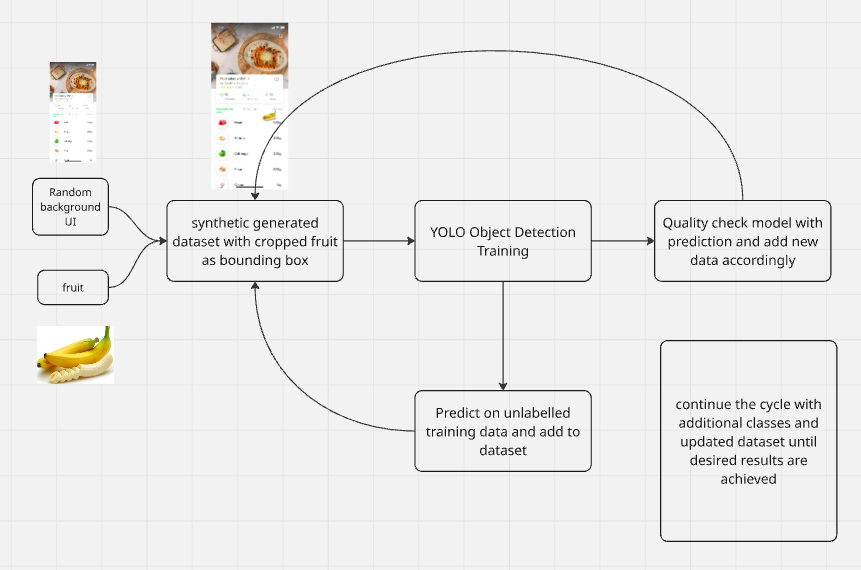
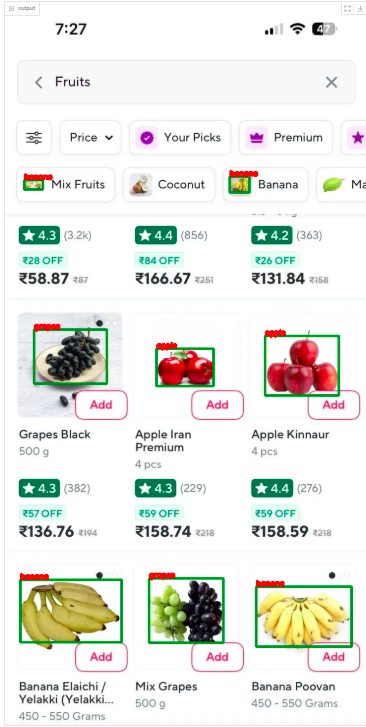

# Drizz AI Fruit Detection Assessment #


### Proposed Solution ###




### Result ###


```commandline
pip install -r requirements.txt
```

### Gradio Demo ###

```commandline
python app.py
```

### Data Generation ###

#### Training Pipeline accepts COCO json format ####
```commandline
cd tools
python datagen.py
python yolo2json.py -p train --output train.json
```

### Training and model export ###

#### Place train-valid folder & json in a folder called datasets and train #### 

```commandline
python train.py -f exps/default/yolox_nano.py -d 1 -b 8 --fp16
python export_onnx.py -f exps/default/yolox_nano.py -c YOLOX_outputs/yolox_nano/trained_ckpt.pth  --output-name YOLOX_outputs/yolox_nano/fruit-detection.onnx
```

### Testing ###

```commandline
python yolox_onnx.py
```


